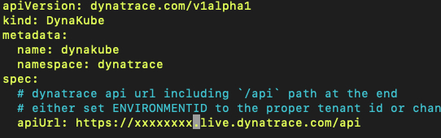

## Dynatrace via kubectl

In this step we'll use the command line to install the Dynatrace Operator.

### Deploy Dynatrace

Create a namespace for Dynatrace.

```bash
kubectl create namespace dynatrace
```

Get the configuration for Dynatrace.

```bash
kubectl apply -f https://github.com/Dynatrace/dynatrace-operator/releases/latest/download/kubernetes.yaml
```

> The **apply** command in kubernetes creates and manages resources following a yaml file.  It's a common way to add & configure a number of components at once.  
> a **yaml** (Yaml Ain't Markup Language) file is a text file format designed to be easy to write and read later.  It's powerful and simple- but does require the writer to pay attention to tabs and spacing.  The writer should also be prepared to cry at times when they need to get something done quickly and the format is being extra persnickety.

(Optional) Watch the deployment as it progresses.

```bash
kubectl -n dynatrace logs -f deployment/dynatrace-operator
```

> the **logs** command lets us watch the deployment as it rolls out.

### Connect to Dynatrace

Once the deployment is finished- use the API_TOKEN and PAAS_TOKEN you created in the [Prerequisites](index#prerequisites) to replace the values below.

```bash
kubectl -n dynatrace create secret generic dynakube --from-literal="apiToken=API_TOKEN" --from-literal="paasToken=PAAS_TOKEN"
```

> This command **creates** a new [secret](https://kubernetes.io/docs/concepts/configuration/secret/) named **dynakube** (used shortly) that allows kubernetes to establish a connection to your Dyantrace tenant.

Next we need to configure options.  Download a template to follow:

```bash
curl -Lo cr.yaml https://github.com/Dynatrace/dynatrace-operator/releases/latest/download/cr.yaml
```

Edit the template:

```bash
nano cr.yaml
```

> Nano is a text editor built into Ubuntu.

Using arrow keys, navigate to the apiUrL line and update it as shown (replace x's with your ID)  


That's all we need to update for now.  If you're interested, you can check out all [parameters](https://www.dynatrace.com/support/help/technology-support/container-platforms/kubernetes/monitor-kubernetes-environments/#anchor_parameters).

Save with *ctrl+x*, *Y* for yes, and *enter* to overwrite the template.

Awesome!  Almost there.  Now we need to apply our customization:

```bash
kubectl apply -f cr.yaml
```

You should see a response simliar to *dynakube.dyntrace.com/dynakube created*.

### Next Steps

Now that you have Dynatrace connected to kubernetes, check out the demo applications and showcases you can deploy in [step 5](step5).

### Throwing out this ingredient

If you want to recycle this ingredient for any reason, simply follow the two steps below.

Remove the component you installed.

```bash
kubectl delete -n dynatrace dynakube --all
```

and run the delete command to reverse the apply command.

```bash
kubectl delete -f https://github.com/Dynatrace/dynatrace-operator/releases/latest/download/kubernetes.yaml
```

<script src="{{ base.url | prepend: site.url }}/assets/js/copy.js"></script>
