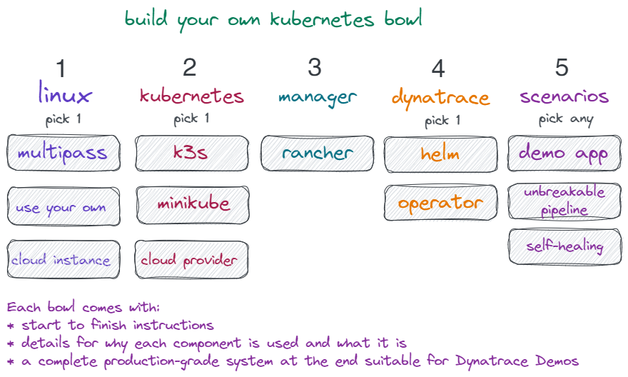

### About

Inspired by "create your own bowl" restaurants this Dynatrace & kubernetes workshop gives you the flexibility to create your own kubernetes environment from various ingredients to learn kubernetes, build a platform to demo Dynatrace in your organization, or both!  

No matter which path you take, you'll end up with:

- a production-grade platform with minimal dependencies
- a solid understanding of what makes up kubernetes & common technologies
- multiple options for real-world scenarios that showcase Dynatrace


### Using this workshop

There are a few common mechanics used throughout the workshop.

```bash
code blocks are meant to be typed (or hover to copy)
and pasted into your command line.
Except this one.  I mean, you CAN copy this block,
but there is no point.
You know what... you do you.  Copy away if it brightens your day.
```

Look for :checkered_flag: **CHECKPOINT** indicators to pause briefly and make sure the ingredients in your bowl are blending together well.

The :memo: indicator gives you additional commands or tips that might be useful when you are exploring your implementation.

> blockquotes will give you more details about what a technology is, why it is used in kubernetes, or what specific parts of a command line do.

### Prerequisites

- A ubuntu server, the ability to build one on a cloud provider, or a PC.  4 cores and 4GB of memory (8GB if PC) are recommended.
- A dynatrace tenant.  [Start one for free!](https://www.dynatrace.com/trial){:target="_blank"}

Within your tenant you'll need:

- Your dynatrace tenant API URL (https://*yourtenant*.live.dynatrace.com/api)
- An [API token](https://www.dynatrace.com/support/help/reference/dynatrace-concepts/access-tokens/#anchor_create-api-token) with at least "access problem feed", "metrics", and "topology" settings
- A [Paas token](https://www.dynatrace.com/support/help/reference/dynatrace-concepts/access-tokens/#anchor_paas-token)

### Ready, steady, ...

There are 5 steps to building your bowl.  You can use the table of contents to quickly move between sections or individual workshop steps.

- Step 1 ensures you have a working server prepared for kubernetes.
- Step 2 gives you muiltiple kubernetes distributions to use.
- Step 3 installs rancher for a unified managemenet and orchestration platform.
- Step 4 install Dynatrace.
- Step 5 gives you multiple options (pick any number) of applications to install to try out kubernetes and showcase the power of Dynatrace.

Once you have the prequisites covered, let's **GO** starting with [step 1](step1)!

<script src="{{ base.url | prepend: site.url }}/assets/js/copy.js"></script>
